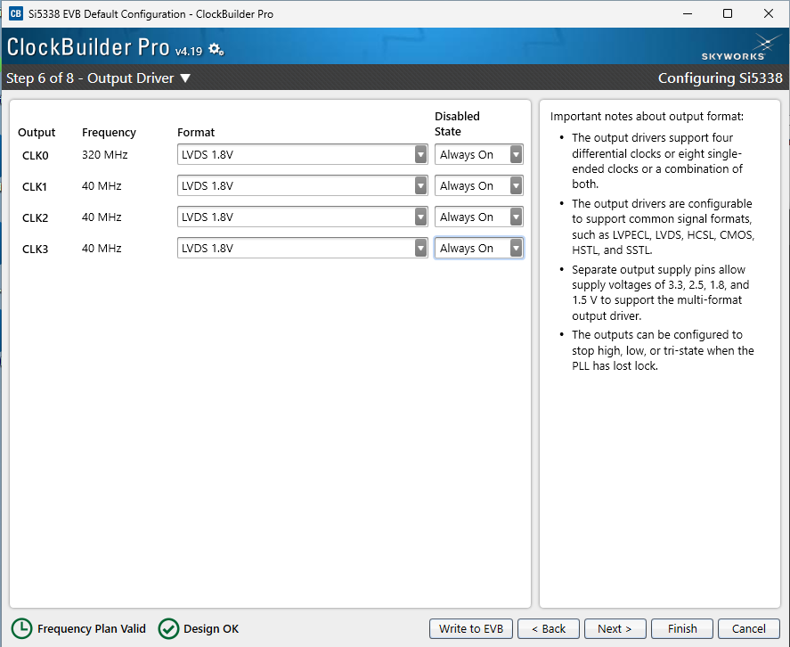
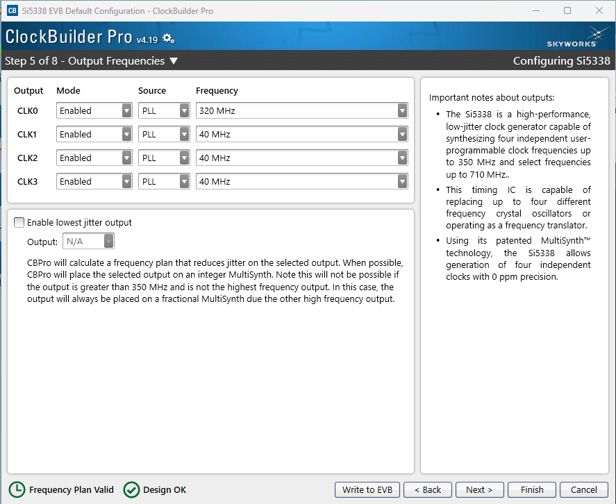

# FCFD I2C Interface

Python tools for reading and writing the FCFD device register over I2C.

## Overview

This repository provides a register-driven interface for the FCFD I2C communication. The main logic lives in `FCFD_I2C_register.py`. JSON format register maps are stored in `regmaps/`. JSON format connection configurations are stored in `config/`. The actually I2C is handled by codes in `I2C/`.

Currently, a windows USB-to-I2C Professional DLL based I2C is achieved in `I2C/I2C_windows.py`. A mock transport using memory as I2C registers is achieved in `I2C/I2C_dummy.py` for testing and developing purpose.

## Project layout

```text
fcfd-i2c/
├── FCFD_I2C_register.py
├── README.md
├── config/
│   ├── config_dummy.json
│   └── config_windows.json
├── I2C/
│   ├── __init__.py
│   ├── I2C.py
│   ├── I2C_dummy.py
│   └── I2C_windows.py
└── regmaps/
    └── FCFD_v1.2.json
```

## Requirements

### Software
- Python 3.9+

### Hardware usage on Windows (Using `I2C_windoes.py`)

- Windows machine
- USB-to-I2C Professional DLL installed and available as `USBtoI2Cpro.dll`
- Valid I2C board address for the target FCFD device

## Configuration

The configuration files tell the software which register map to load and which I2C transport to use. It should be in the following JSON format.


```json
{
    "regmap": "../regmaps/$REG_MAP_TO_USE",
    "board_addresses": [Address1, Address2, ...],
    "I2C_type": [Type1, Type2, ...]
}
```


The relevant fields are:

- `regmap`: path to the register definition JSON
- `board_addresses`: list of device addresses to query
- `I2C_type`: I2C transport backend, currently either `windows` or `dummy`

## Register map format

The register map JSON defines each register with entries such as:

```json
{
    "reg_name": {
        "access": "rw",
        "address": [0],
        "bit_range": [0, 7],
        "default": 0
    }
}
```

Each register contains:

- `access`: `ro` for read-only, `wo` for write-only, or `rw` for read-write
- `address`: address of register `[address]` or a pair of least significant address and most significant address `[lsa,msa]`.
- `bit_range`: bit positions for the field within the register. 
  - **Single-Byte Register:** For registers contained in a single-byte, it can be `[bit address]` or a pair of least significant bit and most significant bit `[lsb,msb]`
  - **Multi-Byte Register:** For registers spanning multiple bits, for each byte, it shall be described the same as in single-byte scenerio, and packed into a 2-d list in the ascending order of address`[[lsb0,msb0],[lsb1,msb1]]`; specially, if the bit ranges are the same across all bytes, the same format as single-byte registers can be used.
- `default`: default register value (or `"N/A"` for unset values)

## Quick start

### Clone the repository first:

```bash
git clone https://github.com/yulunmiao/fcfd-i2c
cd fcfd-i2c

# currently commented out as no additional package is needed
# pip install -r requirements.txt
```
Then run the example from the repository root:

```bash
python FCFD_I2C_register.py --json ./config/config_dummy.json --read all
```

This reads all readable registers using the dummy backend.

### Read registers

```bash
python FCFD_I2C_register.py --json ./config/config_windows.json --read REG_NAMES
```
This read the value from the registers, or use

```bash
python FCFD_I2C_register.py --json ./config/config_windows.json --read all
```
to read all readable registers.
### Write registers

```bash
python FCFD_I2C_register.py --json ./config/config_windows.json --write REG_NAME VALUES
```

This writes comma-separated values as a byte array to the selected register. Values may be decimal or use Python-style `0b` binary and `0x` hexadecimal prefixes, for example:

```bash
python FCFD_I2C_register.py --json ./config/config_dummy.json --write clk_eq 0b10
python FCFD_I2C_register.py --json ./config/config_dummy.json --write clk_eq 0x2
```

### Set registers to defaults

```bash
python FCFD_I2C_register.py --json ./config/config_windows.json --set-default
```

This set all registers to default value.

### Run self-test

```bash
python FCFD_I2C_register.py --json ./config/config_windows.json --self-test
```
This runs a self test of all read-write registers by writing in a possible values into all reigsters and then read from them. It then compares the difference between the written and read values
### Interactive mode

```bash
python FCFD_I2C_register.py --json ./config/config_windows.json --interactive
```

This lets you enter commands to read, write, set defaults, or run the self-test interactively.

## Command line reference

```bash
python FCFD_I2C_register.py --help
```

Supported options include:

- `--json`, `-j` – configuration JSON file
- `--write`, `-w` – write a register payload
- `--read`, `-r` – read one or more registers, or `all`
- `--set-default`, `-d` – apply default register values
- `--self-test`, `-t` – verify read/write behavior
- `--interactive`, `-i` – interactive terminal prompt
- `--board-address`, `-b` – override address selection
- `--debug`, `-D` – enable debug logging
- `--log-file`, `-l` – write logs to a file

## Python usage

Example of manual use from Python:

```python
from FCFD_I2C_register import FCFD_I2C_register
from I2C.I2C_dummy import I2C_dummy

fcfd = FCFD_I2C_register(
    json_file="regmaps/FCFD_v1.2.json",
    i2cs={0x00: I2C_dummy("regmaps/FCFD_v1.2.json")},
)

error_code, value = fcfd.read(0x00, "some_register")
print(error_code, list(value) if value is not None else None)
```

For real hardware, replace the dummy transport with `I2C_windows`.

## Developing new I2C backend

To add a new transport backend, create a new implementation that subclasses the abstract interface defined in `I2C/I2C.py`.

### Required interface

Every backend must implement the following methods:

```python
from typing import Optional, Tuple
from I2C.I2C import I2C

class I2C_MyBackend(I2C):
    def read(self, board_address: int, address: int, n: int) -> Tuple[int, Optional[bytes]]:
        # Return (error_code, data_bytes)
        # error_code == 0 on success, else non-zero and None on failure
        ...

    def write(self, board_address: int, address: int, data) -> bool:
        # Write bytes to the device and return True/False
        ...

    def get_number_of_devices(self) -> int:
        ...

    def describe_error(self, code: int) -> str:
        ...
```
Some restrictions on the functions include:
- The `read` function Return `0` and raw bytes on successful reads; it should a non-zero error code and `None` on failed reads.
- Provide a readable error mapping through `describe_error` function.
- The `read` and `write` should be operation on bytes instead of bits
Examples can be found as `I2C/I2C_dummy.py`

### Registering the backend in configuration

Once the new backend class exists, add it to the configuration file:

```json
{
    "regmap": "../regmaps/FCFD_v1.2.json",
    "board_addresses": [114],
    "I2C_type": ["custom"]
}
```

Then update the dispatch logic in `FCFD_I2C_register.py` to instantiate the new class when the matching type is selected:

```python
if i2c_type == "custom":
    i2cs[board_address] = I2C_Custom(board_address=board_address)
```

This keeps the rest of the project unchanged and lets the register layer work with any compatible backend.


## Useful documents 

- Dongle DLL manual: https://www.i2ctools.com/Downloads/USBtoI2Cpro/V6/USB-to-I2C_Professional_DLL_Users_Manual.pdf
- Dongle GUI software manual: https://www.i2ctools.com/Downloads/USBtoI2Cpro/USB-to-SPI_Software_Users_Manual.pdf?_ga=2.58411946.1623653603.1787838511-886811140.1786995748

# Clock board configuration (Temporary, to be moved to main project)

To configure the Skyworks Si5338 clock boards:

1. Download ClockBuilder Pro from the Skyworks [site](https://www.skyworksinc.com/Application-Pages/Clockbuilder-Pro-Software).
2. Connect the clock board to the computer via USB.
3. Open the software and look for the “evaluation board detected” section.
4. Click “open default plan”.
5. Accept the prompt to write the design if prompted.
6. In the Design Dashboard, go to steps five and six and configure the board as required.
7. Keep the configuration consistent with the board screenshots, while adjusting output frequencies to your target values as needed.

As an example setup for one 320MHz and three 40MHz clocks can be found in the following screenshots.



## Useful documents

- Clock software manual: https://tools.skyworksinc.com/timingfiles/latest-tools/ClockBuilder-Pro-README.pdf 